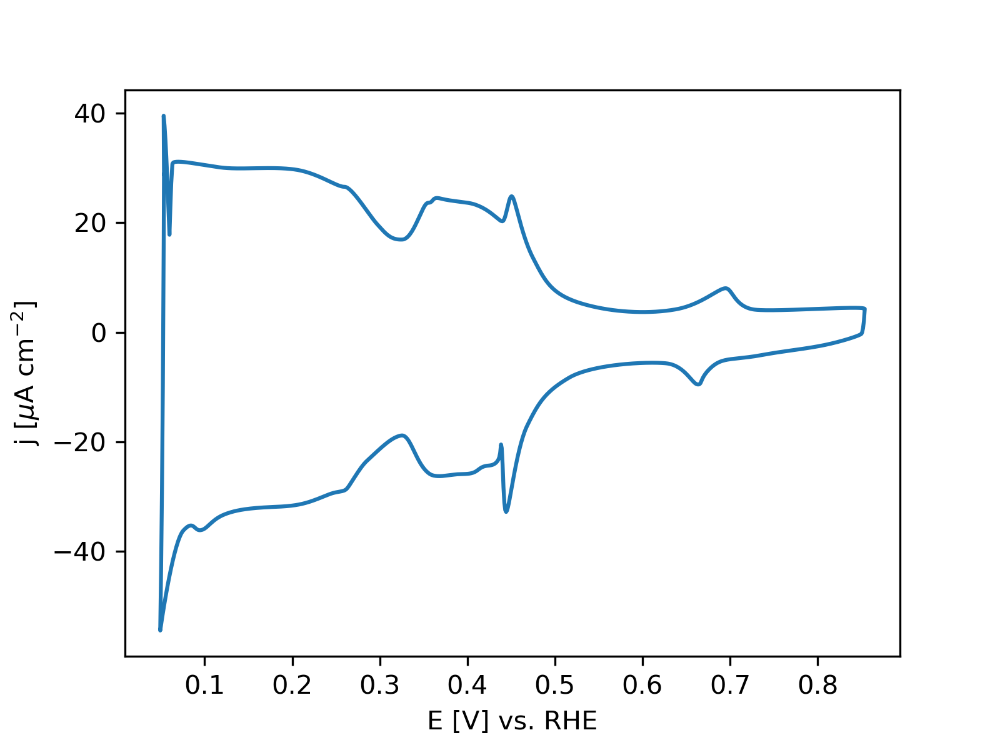
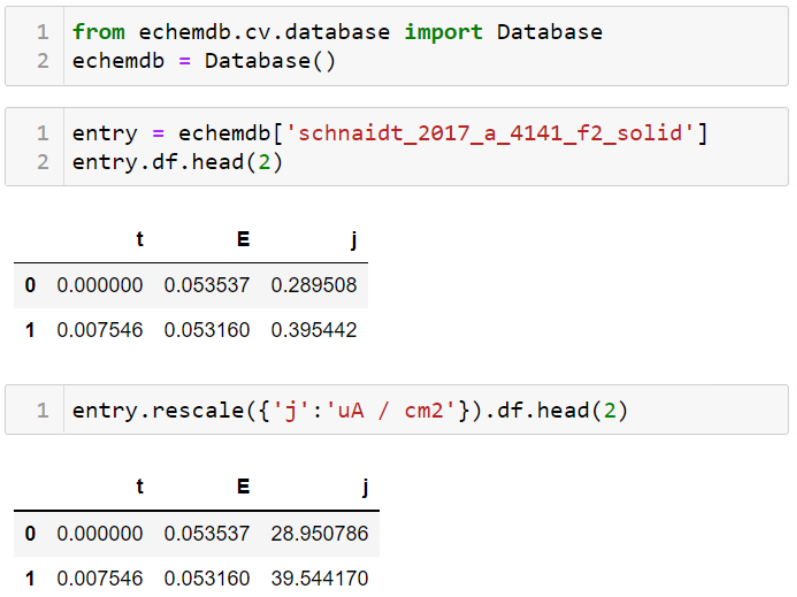

---
hide:
- toc
- navigation
---
# echemdb - the community database for electrochemical data

<figure class="echemdb-spotlight" markdown>

<figcaption markdown>
## Philosophy

echemdb aims at standardizing electrochemical data according to the 
[FAIR principles](https://www.go-fair.org/fair-principles/), allowing 
comparison of published data with data acquired 
in the laboratory, and theoretical models.

[→ Learn more](about.md)
</figcaption>
</figure>

<figure class="echemdb-spotlight echemdb-spotlight-reverse" markdown>

<figcaption markdown>
## Website

The website shows cyclic voltammograms from the echemdb data repository
which were standardized and validated from published works by the community.

[→ Explore](./cv).
</figcaption>
</figure>

<figure class="echemdb-spotlight" markdown>

<figcaption markdown>
## API

The echemdb Python module provides an interactive way to visualize, filter, 
or evaluate the entries in the database.

[→ Explore](https://mybinder.org/v2/gh/echemdb/echemdb/0.3.0?urlpath=tree%2Fdoc%2Fusage%2Fentry_interactions.md)  
[→ Documentation](https://echemdb.github.io/echemdb/).

</figcaption>
</figure>

<figure class="echemdb-spotlight echemdb-spotlight-reverse" markdown>

<figcaption markdown>
## Metadata

A metadata schema for electrochemical measurements
renders electrochemical data interoperable. 

[→ Learn more](https://github.com/echemdb/metadata-schema)
</figcaption>
</figure>

<figure class="echemdb-spotlight" markdown>

<figcaption markdown>
## Digitizer

The svgdigitizer recovers data
from published figures,
where machine-readable data is not available.

[→ Learn more](https://echemdb.github.io/svgdigitizer/)  
[→ Digitize a plot for echemdb](https://echemdb.github.io/svgdigitizer/workflow.html).

</figcaption>
</figure>

