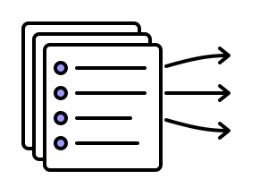
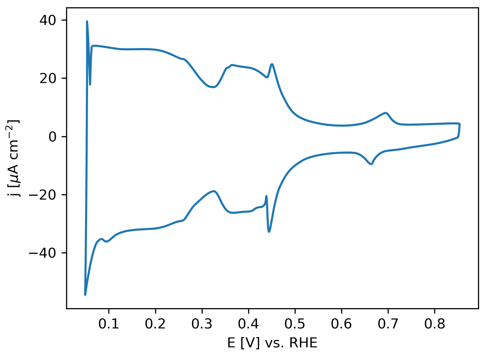
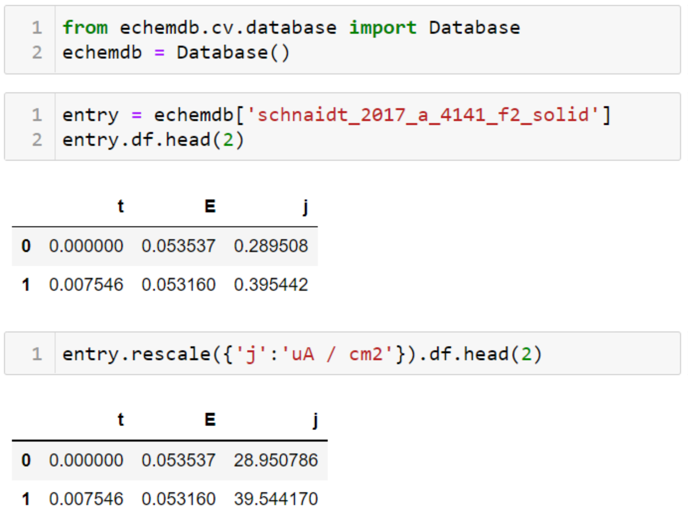
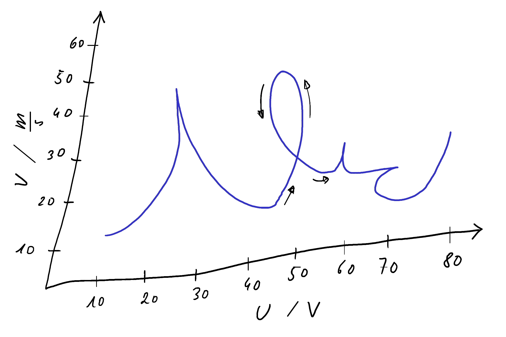
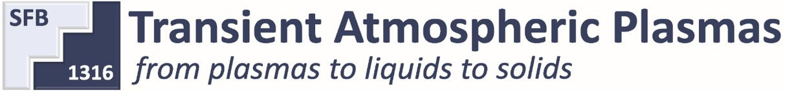

---
hide:
- toc
- navigation
---
# echemdb - a community project for interfacial electrochemistry and local research data management

<figure class="echemdb-spotlight" markdown>

<figcaption markdown>
## Philosophy

echemdb aims at standardizing data for interfacial electrochemistry according to the
[FAIR principles](https://www.go-fair.org/fair-principles/), allowing
comparison of published data with data acquired
in the laboratory, and theoretical models.

[→ Learn more](about.md)
</figcaption>
</figure>

<figure class="echemdb-spotlight echemdb-spotlight-reverse" markdown>

<figcaption markdown>
## Resources

A curated collection of open-source software tools, knowledge bases, and
best-practice literature for acquiring, reporting, and reusing electrochemical data.

[→ Browse the resources](resources/index.md)
</figcaption>
</figure>

<figure class="echemdb-spotlight" markdown>

<figcaption markdown>
## CV Dataset

A [dataset of cyclic voltammograms (CVs)](https://doi.org/10.5281/zenodo.20723429) for redox processes at the solid liquid interface
from the [echemdb data repository](https://github.com/echemdb/electrochemistry-data), which were standardized and validated from published works by the community.

[→ Explore](./cv)
</figcaption>
</figure>

<figure class="echemdb-spotlight echemdb-spotlight-reverse" markdown>

<figcaption markdown>
## API

The unitpackage Python module provides an interactive way to visualize, filter,
or evaluate the entries in the database and provides an approach for local research data management (RDM).

[→ Documentation](https://echemdb.github.io/unitpackage/)

</figcaption>
</figure>

<figure class="echemdb-spotlight" markdown>

<figcaption markdown>
## Metadata

A metadata schema for electrochemical measurements
renders electrochemical data interoperable.

[→ Learn more](https://github.com/echemdb/metadata-schema)
</figcaption>
</figure>

<figure class="echemdb-spotlight echemdb-spotlight-reverse" markdown>

<figcaption markdown>
## Automated Data Annotation

AutotagMetadata is a tool with a GUI for automated tagging of newly created data in the laboratory using pre-defined metadata templates.

[→ Learn more](https://echemdb.github.io/autotag-metadata/)
</figcaption>
</figure>

<figure class="echemdb-spotlight" markdown>

<figcaption markdown>
## Digitizer

The svgdigitizer allows recovering data from published figures,
where machine-readable data is not available.

[→ Learn more](https://echemdb.github.io/svgdigitizer/)

[→ Digitize a plot for echemdb](https://echemdb.github.io/svgdigitizer/workflow.html)

</figcaption>
</figure>

## Funding and support

[{width=200 .logo-bg}](https://www.uni-ulm.de/en/nawi/institute-of-electrochemistry/) [{width=200 .logo-bg}](https://www.fhi.mpg.de/th-department) [{width=200 .logo-bg}](https://sfb1316.rub.de/index.php/en/) [{width=200 .logo-bg}](https://nfdi4chem.de/)
